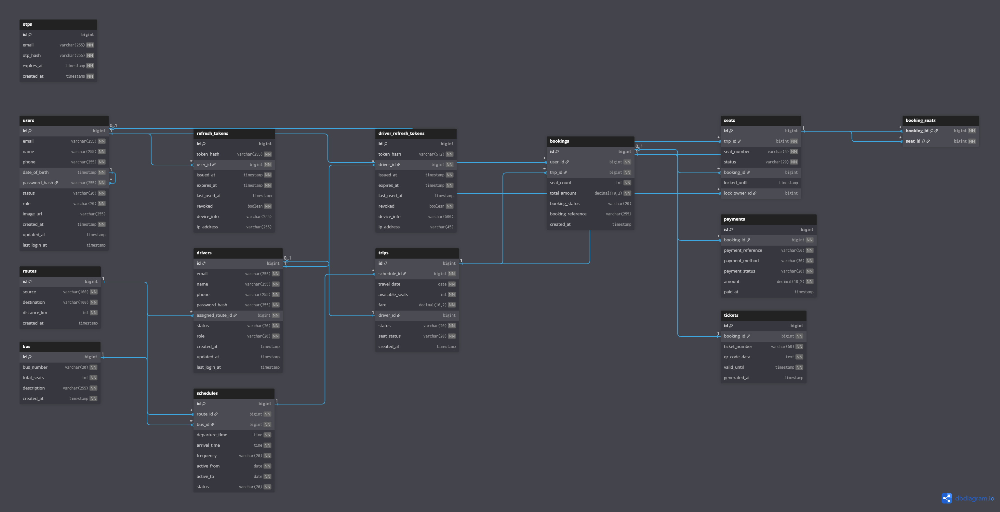

<div align="center">
  <h1>Zytra Bus</h1>
  <p>Modern Bus Booking Platform with Real-time Seat Management</p>
  
  [](LICENSE)
  [](https://openjdk.org/)
  [](https://spring.io/projects/spring-boot)
  [](https://nextjs.org/)
  [](https://react.dev/)
</div>

## 📋 Table of Contents

- [Overview](#overview)
- [Features](#features)
- [Architecture](#architecture)
- [Tech Stack](#tech-stack)
- [Getting Started](#getting-started)
  - [Prerequisites](#prerequisites)
  - [Installation](#installation)
  - [Configuration](#configuration)
- [Project Structure](#project-structure)
- [Development](#development)
- [API Documentation](#api-documentation)
- [Deployment](#deployment)
- [Testing](#testing)
- [Contributing](#contributing)
- [License](#license)

## 🎯 Overview

Zytra Bus is a production-ready, full-stack bus booking platform designed to handle high-concurrency seat reservations with enterprise-grade reliability. The system consists of three microservices: a customer-facing application, a driver management application, and a robust Spring Boot backend with PostgreSQL database.

## ✨ Features

### Core Functionality

- 🔍 **Smart Bus Search** - Real-time availability with advanced filtering
- 🎫 **Seat Reservation** - Interactive seat selection with live updates
- 💳 **Secure Payments** - Multiple payment methods with transaction safety
- 📱 **User Accounts** - Profile management, booking history, and preferences
- 🚌 **Driver Portal** - Dedicated interface for trip and route management
- 📧 **Email Notifications** - Booking confirmations and trip reminders

### Advanced Capabilities

#### Concurrency & Booking Safety

- **Seat Locking System** - Temporary reservation holds with configurable TTL prevent simultaneous bookings
- **Atomic Transactions** - ACID-compliant booking operations using Spring Data JPA
- **Double-Booking Prevention** - Database constraints and optimistic locking ensure seat uniqueness
- **Distributed Locks** - Redis-based coordination for horizontal scaling
- **Idempotent APIs** - Client-side idempotency keys prevent duplicate bookings on retry
- **Optimistic Concurrency Control** - Version-based conflict detection and resolution

#### Real-time Updates

- **Live Seat Availability** - WebSocket/polling for instant seat status updates
- **Conflict Resolution** - Graceful handling of concurrent booking attempts
- **Audit Trail** - Complete booking lifecycle tracking and reconciliation

## 🏗 Architecture

```
┌─────────────────┐       ┌─────────────────┐       ┌─────────────────┐
│   User App      │       │   Driver App    │       │                 │
│   (Next.js)     │◄─────►│   (Next.js)     │◄─────►│  Spring Boot    │
│   Port: 3000    │       │   Port: 3001    │       │  Backend API    │
└─────────────────┘       └─────────────────┘       │  Port: 8080     │
                                                     │                 │
                                                     │  ┌──────────┐   │
                                                     │  │PostgreSQL│   │
                                                     │  └──────────┘   │
                                                     └─────────────────┘
```

**Monorepo Structure:**

- `user_app/` - Customer-facing Next.js application
- `driver_app/` - Driver management Next.js application
- `user_server/` - Unified Spring Boot REST API

### Database Schema

<div align="center">
  
  <p><i>Entity Relationship Diagram showing the complete database architecture</i></p>
</div>

The database schema is designed to support high-concurrency booking operations with optimized relationships for seat management, user authentication, and payment processing. For detailed schema documentation, see [database_schema.dbml](user_server/database_schema.dbml).

## 🛠 Tech Stack

### Frontend

| Technology     | Version | Purpose                      |
| -------------- | ------- | ---------------------------- |
| Next.js        | 16.0.7  | React framework with SSR/SSG |
| React          | 19.2.0  | UI library                   |
| TypeScript     | 5.x     | Type safety                  |
| Tailwind CSS   | 4.x     | Utility-first styling        |
| TanStack Query | 5.90.12 | Server state management      |
| Zustand        | 5.0.9   | Client state management      |
| Axios          | 1.13.2  | HTTP client                  |
| Zod            | -       | Runtime validation           |

### Backend

| Technology      | Version | Purpose               |
| --------------- | ------- | --------------------- |
| Spring Boot     | 4.0.0   | Application framework |
| Java            | 21      | Programming language  |
| Spring Data JPA | 4.0.0   | ORM and data access   |
| PostgreSQL      | -       | Primary database      |
| JWT             | -       | Authentication tokens |
| Spring Mail     | -       | Email service         |
| Maven           | -       | Build tool            |

## 🚀 Getting Started

### Prerequisites

Ensure you have the following installed:

- **Node.js** >= 18.0.0 ([Download](https://nodejs.org/))
- **Java JDK** 21 ([Download](https://openjdk.org/))
- **Maven** 3.8+ ([Download](https://maven.apache.org/))
- **PostgreSQL** 14+ ([Download](https://www.postgresql.org/))
- **Git** ([Download](https://git-scm.com/))

### Installation

1. **Clone the repository**

```bash
git clone https://github.com/yourusername/zytra-bus.git
cd zytra-bus
```

2. **Set up the database**

```bash
# Create PostgreSQL database
createdb zytra_bus

# Or using psql
psql -U postgres
CREATE DATABASE zytra_bus;
\q
```

3. **Install User App dependencies**

```bash
cd user_app
npm install
cd ..
```

4. **Install Driver App dependencies**

```bash
cd driver_app
npm install
cd ..
```

5. **Install backend dependencies**

```bash
cd user_server
mvn clean install
cd ..
```

### Configuration

#### Backend Configuration

Create `user_server/src/main/resources/application.properties`:

```properties
# Database
spring.datasource.url=jdbc:postgresql://localhost:5432/zytra_bus
spring.datasource.username=postgres
spring.datasource.password=yourpassword
spring.jpa.hibernate.ddl-auto=update
spring.jpa.show-sql=true

# JWT
jwt.secret=your-256-bit-secret-key-here
jwt.expiration=86400000

# Email
spring.mail.host=smtp.gmail.com
spring.mail.port=587
spring.mail.username=your-email@gmail.com
spring.mail.password=your-app-password
spring.mail.properties.mail.smtp.auth=true
spring.mail.properties.mail.smtp.starttls.enable=true

# Server
server.port=8080
```

#### Frontend Configuration

Create `user_app/.env.local`:

```bash
NEXT_PUBLIC_API_BASE_URL=http://localhost:8080/api
```

Create `driver_app/.env.local`:

```bash
NEXT_PUBLIC_API_BASE_URL=http://localhost:8080/api
```

### Running the Application

1. **Start the backend**

```bash
cd user_server
mvn spring-boot:run
```

2. **Start the user application** (new terminal)

```bash
cd user_app
npm run dev
```

Access at: http://localhost:3000

3. **Start the driver application** (new terminal)

```bash
cd driver_app
npm run dev
```

Access at: http://localhost:3001

## 📁 Project Structure

```
zytra-bus/
├── user_app/                    # Customer frontend
│   ├── app/                     # Next.js app directory
│   │   ├── (auth)/             # Authentication routes
│   │   ├── (protected)/        # Protected routes
│   │   └── (public-pages)/     # Public routes
│   ├── components/             # React components
│   │   ├── auth/              # Auth components
│   │   ├── bus/               # Bus-related components
│   │   ├── landing/           # Landing page components
│   │   └── ui/                # Reusable UI components
│   ├── contexts/              # React contexts
│   ├── hooks/                 # Custom hooks
│   ├── lib/                   # Utilities and API clients
│   │   ├── api/              # API integration
│   │   └── zod/              # Validation schemas
│   ├── types/                # TypeScript types
│   └── store/                # State management
│
├── driver_app/                 # Driver frontend
│   ├── app/                   # Next.js app directory
│   │   ├── (auth)/           # Authentication routes
│   │   └── (protected)/      # Protected routes
│   ├── components/           # React components
│   ├── contexts/             # React contexts
│   ├── hooks/                # Custom hooks
│   └── lib/                  # Utilities and API clients
│
└── user_server/               # Spring Boot backend
    ├── src/
    │   ├── main/
    │   │   ├── java/com/zytra/user_server/
    │   │   │   ├── config/          # Configuration classes
    │   │   │   ├── controller/      # REST controllers
    │   │   │   ├── dto/             # Data Transfer Objects
    │   │   │   ├── entity/          # JPA entities
    │   │   │   ├── repository/      # Data repositories
    │   │   │   ├── service/         # Business logic
    │   │   │   ├── security/        # Security config
    │   │   │   └── exception/       # Exception handlers
    │   │   └── resources/
    │   │       └── application.properties
    │   └── test/                    # Test classes
    ├── pom.xml                      # Maven configuration
    └── Dockerfile                   # Docker configuration
```

## 💻 Development

### Frontend Development

**User App**

```bash
cd user_app
npm run dev          # Start development server
npm run build        # Build for production
npm run start        # Start production server
npm run lint         # Run ESLint
```

**Driver App**

```bash
cd driver_app
npm run dev          # Start development server
npm run build        # Build for production
npm run start        # Start production server
npm run lint         # Run ESLint
```

### Backend Development

```bash
cd user_server
mvn spring-boot:run          # Run development server
mvn clean install            # Build project
mvn test                     # Run tests
mvn package                  # Package as JAR
```

### Docker Support

**Run with Docker Compose:**

```bash
# User App
cd user_app
docker-compose up

# Driver App
cd driver_app
docker-compose up

# Backend
cd user_server
docker-compose up
```

## 📚 API Documentation

### Authentication

- `POST /api/auth/register` - Register new user
- `POST /api/auth/login` - Login and receive JWT
- `POST /api/auth/verify` - Verify email
- `POST /api/auth/refresh` - Refresh access token

### Users

- `GET /api/users/profile` - Get user profile
- `PUT /api/users/profile` - Update user profile
- `GET /api/users/bookings` - Get user booking history

### Buses

- `GET /api/buses` - Search available buses
- `GET /api/buses/{id}` - Get bus details
- `GET /api/buses/{id}/seats` - Get seat availability

### Bookings

- `POST /api/bookings` - Create new booking
- `GET /api/bookings/{id}` - Get booking details
- `PUT /api/bookings/{id}/cancel` - Cancel booking
- `POST /api/bookings/{id}/payment` - Process payment

### Driver Routes

- `GET /api/driver/trips` - Get assigned trips
- `PUT /api/driver/trips/{id}/status` - Update trip status

## 🚢 Deployment

### Frontend Deployment (Vercel)

```bash
cd user_app
npm run build
# Deploy to Vercel, Netlify, or your preferred hosting
```

### Backend Deployment

**Build JAR:**

```bash
cd user_server
mvn clean package -DskipTests
```

**Run JAR:**

```bash
java -jar target/user_server-0.0.1-SNAPSHOT.jar
```

**Docker Deployment:**

```bash
docker build -t zytra-bus-backend .
docker run -p 8080:8080 zytra-bus-backend
```

### Environment Variables (Production)

Ensure all sensitive data is stored in environment variables:

- Database credentials
- JWT secret keys
- Email service credentials
- API keys

## 🧪 Testing

### Frontend Tests

```bash
cd user_app
npm run test
npm run test:coverage
```

### Backend Tests

```bash
cd user_server
mvn test
mvn verify
```

## 🤝 Contributing

We welcome contributions! Please follow these steps:

1. Fork the repository
2. Create a feature branch (`git checkout -b feature/amazing-feature`)
3. Commit your changes (`git commit -m 'Add amazing feature'`)
4. Push to the branch (`git push origin feature/amazing-feature`)
5. Open a Pull Request

### Code Style Guidelines

- Frontend: Follow ESLint configuration
- Backend: Follow Java code conventions
- Write meaningful commit messages
- Add tests for new features
- Update documentation as needed

## 📄 License

This project is licensed under the MIT License - see the LICENSE file for details.

## 👥 Authors

**Your Name** - Initial work

## 🙏 Acknowledgments

- Spring Boot team for the excellent framework
- Next.js team for the powerful React framework
- All contributors who have helped shape this project

---

<div align="center">
  Made with ❤️ by the Zytra Bus Team
</div>
