# Zytra Bus - Application Workflow Guide

This document provides a detailed walkthrough of the Zytra Bus platform, illustrating the complete user journey, driver workflows, and system processes.

## Table of Contents

- [User Application Workflow](#user-application-workflow)
  - [Registration & Authentication](#1-registration--authentication)
  - [Bus Search & Selection](#2-bus-search--selection)
  - [Seat Selection](#3-seat-selection)
  - [Booking Process](#4-booking-process)
  - [Payment Processing](#5-payment-processing)
  - [Booking Management](#6-booking-management)
- [Driver Application Workflow](#driver-application-workflow)
  - [Driver Login](#1-driver-login)
  - [Trip Management](#2-trip-management)
  - [Trip Updates](#3-trip-updates)
- [System Architecture Flow](#system-architecture-flow)
- [Real-time Features](#real-time-features)

---

## User Application Workflow

### 1. Registration & Authentication

#### 1.1 Landing Page

The user first arrives at the landing page featuring the platform's value propositions and call-to-action buttons.

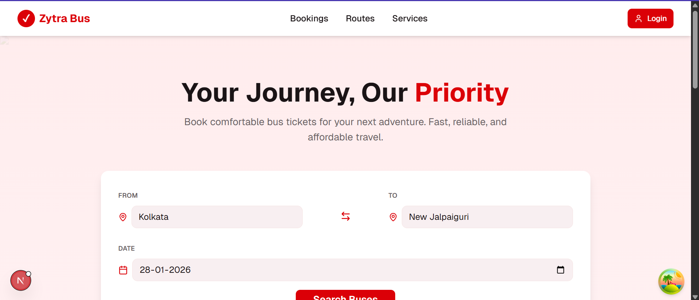

**Key Features:**

- Hero section with search preview
- Feature highlights
- Responsive navigation
- Quick access to login/register

---

#### 1.2 User Registration

New users can create an account by providing basic information.

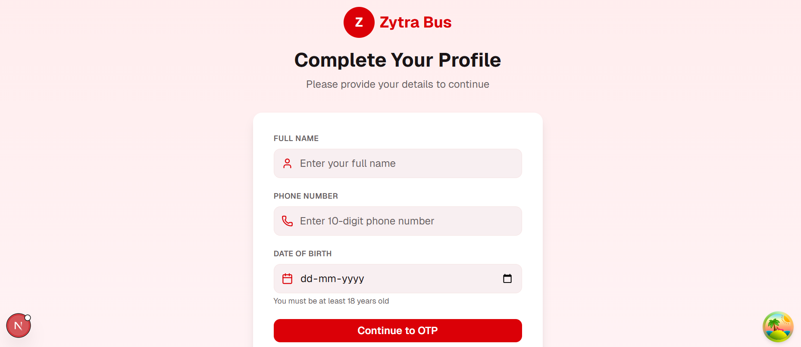

**Registration Flow:**

1. User enters email, password, and personal details
2. Frontend validates input using Zod schemas
3. Request sent to `POST /api/auth/register`
4. Backend creates user account
5. Verification email sent
6. User redirected to email verification page

**Technical Details:**

- Client-side validation with React Hook Form + Zod
- Password strength requirements enforced
- Email uniqueness checked at backend
- JWT token generated upon successful registration

---

#### 1.3 Email Verification

Users must verify their email address before accessing the platform.

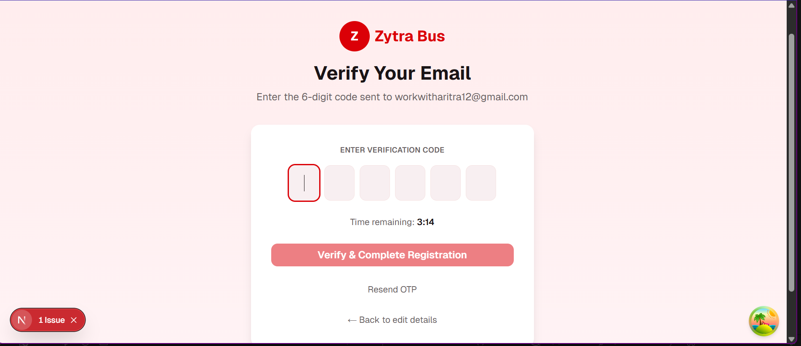

**Verification Flow:**

1. User receives verification email
2. Clicks verification link
3. Token validated at `POST /api/auth/verify`
4. Account activated
5. Auto-redirect to login page

---

#### 1.4 User Login

Registered users can log in to access the booking platform.

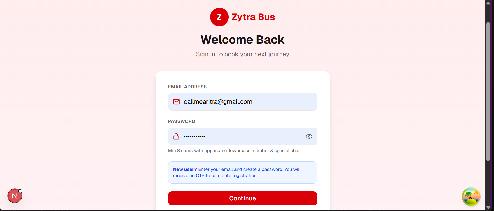

**Login Flow:**

1. User enters credentials
2. Request sent to `POST /api/auth/login`
3. Backend validates credentials
4. JWT access token and refresh token returned
5. Tokens stored in AuthContext
6. User redirected to dashboard/home

---

### 2. Bus Search & Selection

#### 2.1 Search Interface

Users can search for available buses based on their travel requirements.

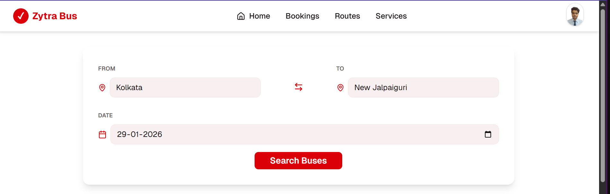

**Search Parameters:**

- Origin city/location
- Destination city/location
- Travel date
- Number of passengers (optional)
- Bus type filters (optional)

**Search Flow:**

1. User fills search form
2. Request sent to `GET /api/buses?origin={origin}&destination={destination}&date={date}`
3. Backend queries available buses
4. Results displayed with real-time availability
5. Users can filter/sort results

---

#### 2.2 Search Results

Available buses are displayed with key information for comparison.

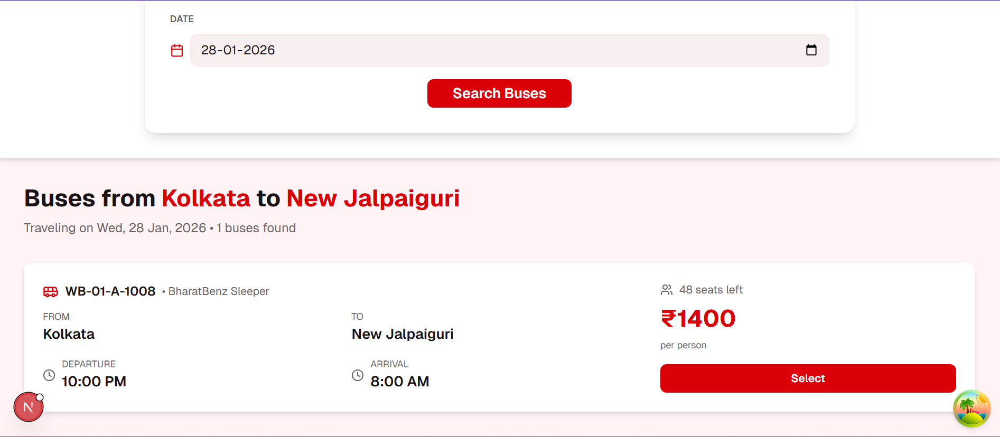

**Displayed Information:**

- Bus operator name
- Departure and arrival times
- Journey duration
- Available seats count
- Price per seat
- Bus type and amenities
- Ratings and reviews

**User Actions:**

- View detailed bus information
- Compare multiple buses
- Select bus for booking

---

#### 2.3 Bus Details

Detailed view of selected bus with comprehensive information.

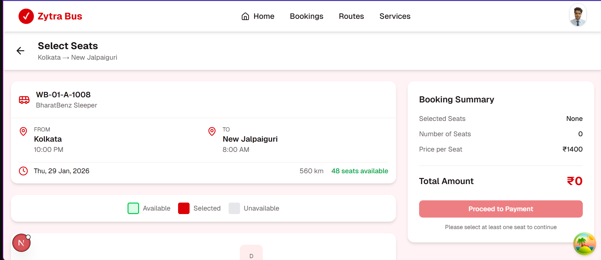

**Details Include:**

- Complete schedule information
- Amenities (AC, WiFi, charging ports, etc.)
- Boarding and dropping points
- Cancellation policy
- User reviews and ratings
- Photo gallery

---

### 3. Seat Selection

#### 3.1 Interactive Seat Layout

Visual representation of the bus seat layout for selection.


**Seat Status Legend:**

- 🟢 **Available** - Can be selected
- 🔴 **Selected** - Currently selected by you
- ⚪ **Booked** - Already reserved
- 🟡 **On Hold** - Temporarily locked by another user

**Selection Flow:**

1. User views seat layout from `GET /api/buses/{id}/seats`
2. Clicks available seats to select
3. Selected seats temporarily locked (reservation hold)
4. Real-time updates via WebSocket/polling
5. User confirms selection or can modify

**Concurrency Safety:**

- Selected seats locked for 10 minutes (configurable TTL)
- Other users cannot select locked seats
- Optimistic locking prevents double booking
- Real-time seat status updates

---

### 4. Booking Process

#### 4.1 Booking Summary

Review all booking details before payment.

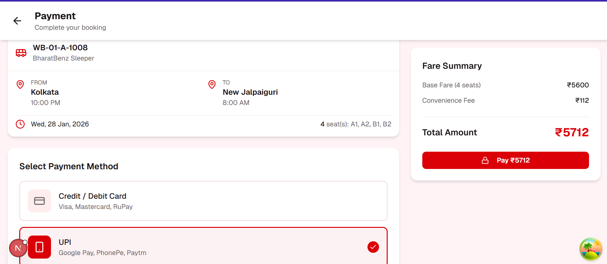

**Summary Includes:**

- Trip details (route, date, time)
- Selected seats
- Passenger information
- Price breakdown
  - Base fare
  - Taxes and fees
  - Total amount
- Cancellation policy
- Terms and conditions

---

#### 4.2 Booking Confirmation

Backend processes the booking request with transaction safety.

**Booking API Flow:**

```
POST /api/bookings
{
  "busId": "123",
  "tripId": "456",
  "seats": ["A1", "A2"],
  "passengers": [...],
  "idempotencyKey": "unique-key"
}
```

**Backend Processing:**

1. Validates seat availability with locks
2. Begins database transaction
3. Creates booking record
4. Assigns seats atomically
5. Releases temporary holds
6. Commits transaction or rolls back on error
7. Returns booking ID and details

**Safety Mechanisms:**

- Database transactions ensure atomicity
- Unique constraints prevent duplicate seat assignments
- Idempotency keys prevent duplicate bookings on retry
- Optimistic locking with version fields
- Distributed locks for horizontal scaling

---

### 6. Booking Management

#### 6.1 Booking Details

Detailed view of individual booking.

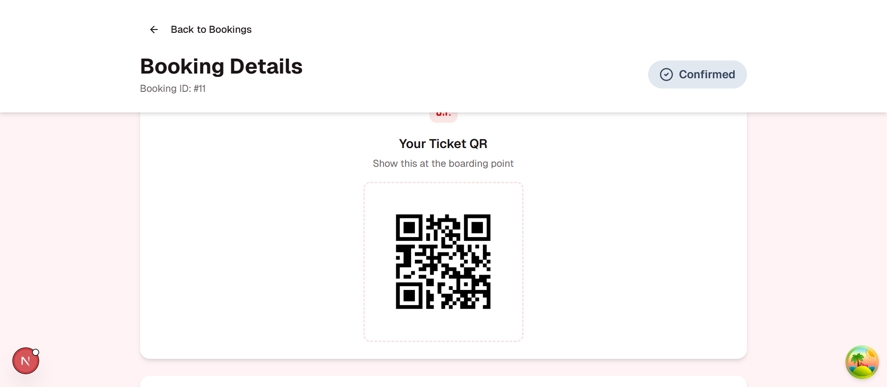


**Information Displayed:**

- Complete trip information
- E-ticket with QR code
- Passenger details
- Payment receipt
- Boarding point details
- Cancellation option
- Support contact

---

#### 6.2 My Bookings

List of all user bookings with filtering options.


**Features:**

- Filter by status (upcoming, completed, cancelled)
- Search bookings
- Sort options
- Quick actions menu
- Download tickets in bulk

---

#### 6.3 Account Settings

User profile and preferences management.

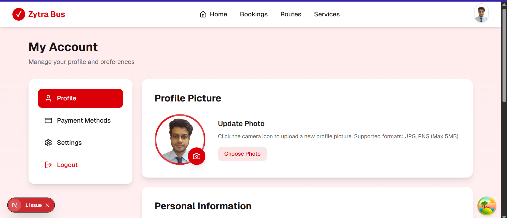

**Settings Include:**

- Personal information
- Contact details
- Password change
- Email preferences
- Notification settings
- Saved payment methods
- Travel preferences

---

## Driver Application Workflow

### 1. Driver Login

#### 1.1 Driver Authentication

Dedicated login interface for bus drivers and operators.


**Login Flow:**

1. Driver enters credentials
2. Role-based authentication at `POST /api/auth/login`
3. Backend validates driver role
4. Driver-specific JWT token issued
5. Redirect to driver dashboard

---

### 2. Trip Management

#### 2.1 Driver Dashboard

Overview of assigned trips and current status.

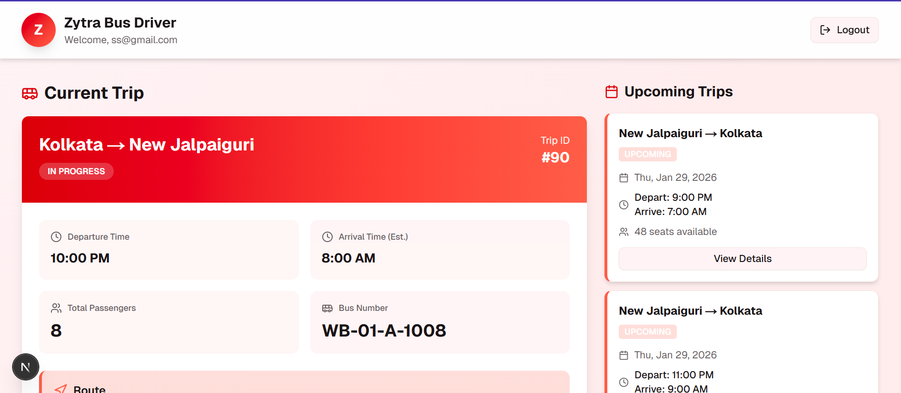

**Dashboard Features:**

- Today's trips
- Upcoming trips
- Trip statistics
- Quick status updates
- Notifications

---

#### 2.2 Passenger List

View all passengers for the current trip.

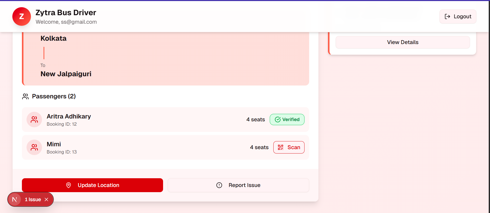
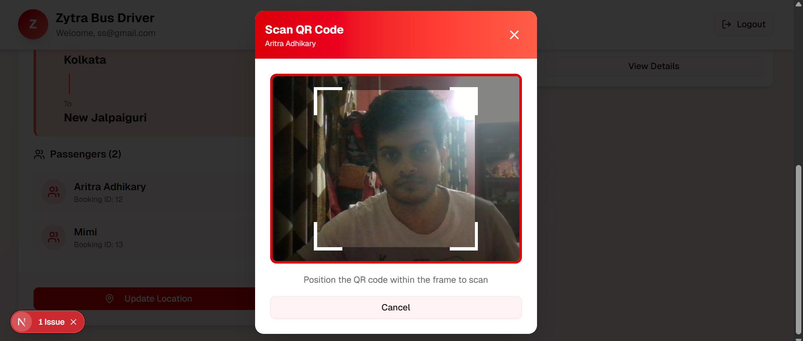

**Features:**

- Search passengers by name/seat
- Verify boarding status
- Mark passengers as boarded
- Emergency contact access
- Seat-wise passenger mapping

---

## System Architecture Flow

### Complete Booking Flow Diagram

```
┌─────────────┐
│   User      │
│  Browser    │
└──────┬──────┘
       │
       │ 1. Search Buses
       ▼
┌─────────────────┐
│   Next.js       │
│   User App      │◄──────── TanStack Query (Cache & State)
│  (Port 3000)    │
└────────┬────────┘
         │
         │ 2. HTTP Request (Axios)
         ▼
┌─────────────────────────────────────┐
│      Spring Boot Backend            │
│         (Port 8080)                 │
│                                     │
│  ┌──────────────────────────────┐  │
│  │   JWT Authentication         │  │
│  │   Filter Chain               │  │
│  └──────────┬───────────────────┘  │
│             │                       │
│             ▼                       │
│  ┌──────────────────────────────┐  │
│  │   REST Controllers           │  │
│  │   - AuthController           │  │
│  │   - BusController            │  │
│  │   - BookingController        │  │
│  └──────────┬───────────────────┘  │
│             │                       │
│             ▼                       │
│  ┌──────────────────────────────┐  │
│  │   Service Layer              │  │
│  │   - Business Logic           │  │
│  │   - Seat Locking             │  │
│  │   - Transaction Management   │  │
│  └──────────┬───────────────────┘  │
│             │                       │
│             ▼                       │
│  ┌──────────────────────────────┐  │
│  │   Repository Layer           │  │
│  │   (Spring Data JPA)          │  │
│  └──────────┬───────────────────┘  │
└─────────────┼───────────────────────┘
              │
              ▼
    ┌──────────────────┐
    │   PostgreSQL     │
    │    Database      │
    └──────────────────┘
```

### Concurrent Booking Safety Flow

```
User A                    Backend                      User B
  │                          │                           │
  │  1. Select Seats A1,A2   │                           │
  ├─────────────────────────►│                           │
  │                          │                           │
  │  2. Lock seats (10 min)  │                           │
  │◄─────────────────────────┤                           │
  │                          │                           │
  │                          │  3. Try select A1         │
  │                          │◄──────────────────────────┤
  │                          │                           │
  │                          │  4. Seat locked (error)   │
  │                          ├──────────────────────────►│
  │                          │                           │
  │  5. Confirm booking      │                           │
  ├─────────────────────────►│                           │
  │                          │                           │
  │  6. Begin Transaction    │                           │
  │                          ├──┐                        │
  │                          │  │ Check availability     │
  │                          │  │ Create booking         │
  │                          │  │ Assign seats           │
  │                          │  │ Release locks          │
  │                          │◄─┘                        │
  │                          │                           │
  │  7. Commit Success       │                           │
  │◄─────────────────────────┤                           │
  │                          │                           │
  │                          │  8. A1 now available?     │
  │                          │◄──────────────────────────┤
  │                          │                           │
  │                          │  9. Booked (unavailable)  │
  │                          ├──────────────────────────►│
```

---

### 1. Notifications System


**Notification Types:**

- Booking confirmation
- Payment success/failure
- Trip status updates
- Cancellation confirmations
- Promotional offers

**Channels:**

- Email (Spring Mail)
- In-app notifications
- SMS (optional integration)
- Push notifications (Progressive Web App)

---

## Performance Optimizations

### 1. Frontend Optimizations

- **Code Splitting** - Dynamic imports for route-based splitting
- **Image Optimization** - Next.js Image component with lazy loading
- **Caching** - TanStack Query for intelligent data caching
- **Bundle Size** - Tree shaking and minification

### 2. Backend Optimizations

- **Database Indexing** - Indexes on frequently queried fields
- **Query Optimization** - JPA query hints and fetch strategies
- **Connection Pooling** - HikariCP for efficient connections
- **Caching Layer** - Redis for frequently accessed data (optional)

### 3. API Performance

- **Pagination** - Large result sets paginated
- **Rate Limiting** - Prevents API abuse
- **Compression** - Gzip compression enabled
- **CDN** - Static assets served via CDN

---

## Security Measures

### 1. Authentication & Authorization

- JWT-based stateless authentication
- Role-based access control (User/Driver/Admin)
- Token refresh mechanism
- Secure password hashing (BCrypt)

### 2. Data Protection

- HTTPS enforcement
- SQL injection prevention (JPA/Hibernate)
- XSS protection
- CSRF tokens
- Input validation and sanitization

### 3. API Security

- Rate limiting
- Request validation
- CORS configuration
- API versioning
- Security headers

---

## Testing Workflow

### 1. User Journey Testing

- Registration → Login → Search → Book → Pay
- Edge cases and error scenarios
- Concurrent booking attempts
- Payment gateway integration

### 2. Performance Testing

- Load testing with multiple concurrent users
- Seat locking stress tests
- Database transaction testing
- API response time benchmarks

### 3. Security Testing

- Authentication bypass attempts
- SQL injection tests
- XSS vulnerability tests
- CSRF protection validation

---

## Deployment Workflow

### Development → Staging → Production

```
┌──────────────┐      ┌──────────────┐      ┌──────────────┐
│ Development  │      │   Staging    │      │  Production  │
│              │      │              │      │              │
│ Local Server │─────►│ Test Server  │─────►│ Live Server  │
│ localhost    │      │ staging.xyz  │      │ zytra.com    │
└──────────────┘      └──────────────┘      └──────────────┘
       │                     │                      │
       │                     │                      │
   Feature Dev          QA Testing            Live Users
```

---

## Support & Maintenance

### User Support Flow

1. User submits support request
2. Ticket created in support system
3. Support team reviews
4. Resolution provided
5. Follow-up confirmation

### Monitoring & Logging

- Application logs (Spring Boot)
- Error tracking (exception handlers)
- Performance metrics
- User analytics
- Database query logs

---

## Future Enhancements

### Planned Features

- [ ] Multi-language support
- [ ] Advanced analytics dashboard
- [ ] Loyalty rewards program
- [ ] Mobile native apps (iOS/Android)
- [ ] AI-powered route recommendations
- [ ] Dynamic pricing based on demand
- [ ] Integration with more payment gateways
- [ ] Real-time GPS tracking
- [ ] In-app chat support
- [ ] Social sharing features

---

## Screenshots Directory Structure

To add screenshots to this workflow document, organize them as follows:

```
docs/
└── screenshots/
    ├── user/
    │   ├── 01-landing-page.png
    │   ├── 02-registration.png
    │   ├── 03-email-verification.png
    │   └── ... (more user screenshots)
    ├── driver/
    │   ├── 01-driver-login.png
    │   ├── 02-driver-dashboard.png
    │   └── ... (more driver screenshots)
    ├── mobile/
    │   ├── 01-mobile-home.png
    │   └── ... (more mobile screenshots)
    └── system/
        ├── 01-realtime-updates.png
        └── ... (more system screenshots)
```

---

**Document Version:** 1.0  
**Last Updated:** January 29, 2026  
**Maintained by:** Zytra Bus Team
